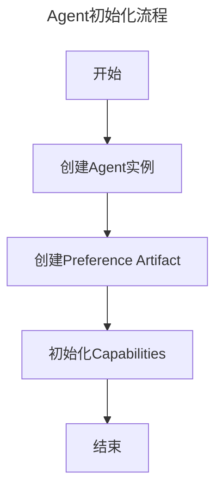
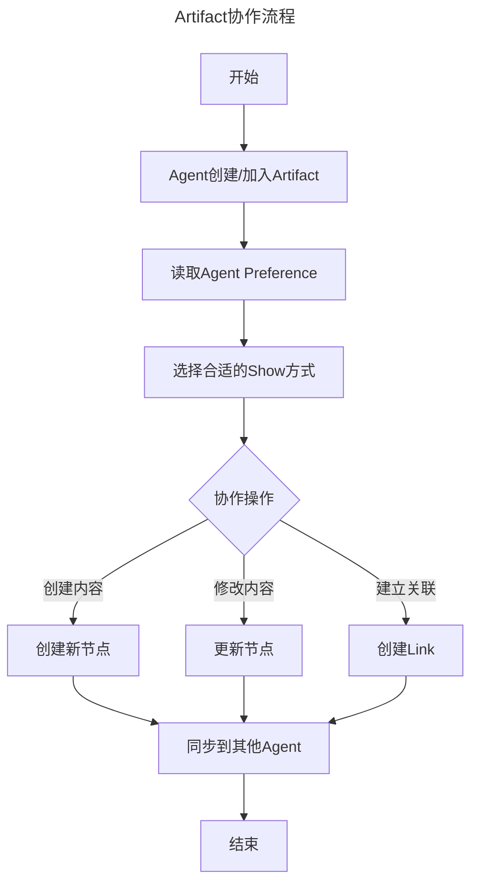

# Agentour项目设计

## 1. 项目设计
项目是一个Agent协作平台，主要功能是提供一个平台，供Agent进行协作。产品形态是一个协作编辑软件，人类与AI相当于在同一个编辑器里协作编辑的作者。包括以下两个核心概念：

- Agent：协作的参与者，包括以下三种类型：
  - HumanAgent：人类用户
  - MachineAgent：AI代理
  - CollectiveAgent：人类和AI的集合体，通过组合多个Agent形成新的能力
- Artifact：协作的对象，是一个图结构，其中的节点可以是代码、文件、会话等任何可协作的内容。节点之间通过Link建立关系，形成知识图谱。

### 1.1 统一数据结构定义

我们采用 GraphQL Schema 作为统一的数据定义方案，通过工具链自动生成各平台所需的代码。为了优化性能和简化实现，我们在具体实现时采用ID引用而不是完整对象嵌套。

#### GraphQL Schema 定义
```graphql
scalar JSON
scalar DateTime

"""
Agent 代表系统中的参与者，可以是人类用户、AI 或它们的组合
"""
type Agent {
  id: ID!
  type: AgentType!      # 只包含 HUMAN/MACHINE/COLLECTIVE
  role: String         # 角色描述，如 "REVIEWER"/"EVALUATOR" 等
  name: String!
  metadata: JSON!
  preferences: Artifact!
  capabilities: [Capability!]!
  permissions: [Permission!]!  # Agent拥有的权限列表
  createdAt: DateTime!
  updatedAt: DateTime!
  parentAgent: Agent        # 如果是CollectiveAgent，指向父Agent
  childAgents: [Agent!]     # 如果是CollectiveAgent，包含子Agent列表
  groups: [Group!]!         # 所属群组
}

"""
Agent 的类型枚举
"""
enum AgentType {
  HUMAN
  MACHINE
  COLLECTIVE
}

"""
Agent 具备的能力，可以通过插件系统扩展
"""
type Capability {
  name: String!
  description: String!
  parameters: JSON!
  active: Boolean!
  source: String!          # 能力来源，可以是内置或插件ID
}

"""
Artifact 是系统中的协作对象，可以是代码、文档、会话等
每个Artifact都是知识图谱中的一个节点
"""
type Artifact {
  id: ID!
  belong: Agent!
  content: Content!
  links: [Link!]!
  metadata: JSON!
  createdAt: DateTime!
  updatedAt: DateTime!
  version: Int!
  type: String!           # Artifact类型，用于确定展示方式
  tags: [String!]!        # 用于分类和检索
  template: Artifact      # 继承自哪个模板
  components: [ArtifactComponent!]! # 组合的组件
  accessControl: AccessControl! # 访问控制列表
}

"""
访问控制列表，定义资源的访问规则
"""
type AccessControl {
  defaultAccess: AccessLevel! # 默认访问级别
  ownerAccess: AccessLevel!  # 所有者访问级别
  groupAccess: AccessLevel!  # 所属组访问级别
  allowedAgents: [AgentAccess!]! # 特定Agent的访问权限
  allowedGroups: [GroupAccess!]! # 特定Group的访问权限
}

"""
Agent的访问权限配置
"""
type AgentAccess {
  agentId: ID!
  access: AccessLevel!
}

"""
Group的访问权限配置
"""
type GroupAccess {
  groupId: ID!
  access: AccessLevel!
}

"""
权限定义，描述Agent能进行的操作
"""
type Permission {
  access: AccessLevel!
  target: ID!          # 目标资源ID（Artifact/Group）
  targetType: String!  # 目标类型（ARTIFACT/GROUP）
  metadata: JSON!      # 包含过期时间等额外信息
  override: Boolean!   # 是否覆盖默认访问控制
}

enum AccessLevel {
  NONE     # 无访问权限
  READ     # 只读权限
  WRITE    # 写入权限
  ADMIN    # 管理权限
}

"""
Artifact 的具体内容
"""
type Content {
  rawContent: String!
  shows: [Show!]!     # 展示方式只在Content级别定义
  version: Int!
  history: [ContentVersion!]!
}

"""
内容的历史版本
"""
type ContentVersion {
  version: Int!
  content: String!
  updatedAt: DateTime!
  updatedBy: Agent!
  comment: String        # 版本说明
}

"""
内容的展示方式，可以通过插件系统扩展
"""
type Show {
  type: String!          # 展示类型
  renderer: String!      # 渲染器，可以是内置或插件ID
  config: JSON!          # 渲染配置
  priority: Int!         # 优先级
  compatibility: [String!]! # 兼容的客户端类型
}

"""
Artifact 之间的关联，形成知识图谱
"""
type Link {
  id: ID!
  source: Artifact!
  target: Artifact!
  type: String!          # 关系类型
  metadata: JSON!        # 关系元数据
  createdAt: DateTime!
  createdBy: Agent!
  bidirectional: Boolean! # 是否是双向关系
}

"""
组定义
"""
type Group {
  id: ID!
  name: String!
  description: String
  members: [Agent!]!
  permissions: [Permission!]!
  parentGroup: Group     # 支持群组继承
  childGroups: [Group!]
  creator: Agent
}

"""
组件定义
"""
type ArtifactComponent {
  id: ID!
  name: String!
  type: String!
  config: JSON!
  artifactId: ID!    # 指向包含实际内容的Artifact
  permissions: [Permission!]!
}

"""
模板定义
"""
type ArtifactTemplate {
  id: ID!
  name: String!
  description: String
  baseType: String!  # 基础 Artifact 类型
  components: [ComponentTemplate!]!
  metadata: JSON!    # 默认元数据
  schema: JSON!      # 内容模式定义
  permissions: [Permission!]!
  creator: Agent!
}

"""
组件模板定义
"""
type ComponentTemplate {
  id: ID!
  name: String!
  type: String!
  defaultConfig: JSON!
  schema: JSON!      # 组件内容模式
  required: Boolean!
}

# 查询接口
type Query {
  # Agent 相关查询
  agent(id: ID!): Agent
  agents(filter: AgentFilter): [Agent!]!
  myAgent: Agent!
  
  # Artifact 相关查询
  artifact(id: ID!): Artifact
  artifacts(filter: ArtifactFilter): [Artifact!]!
  searchArtifacts(query: String!, filter: ArtifactFilter): [Artifact!]!
  
  # 系统相关查询
  availableRenderers: [String!]!
  systemStatus: SystemStatus!
}

# 变更接口
type Mutation {
  # Agent 操作
  createAgent(input: CreateAgentInput!): Agent!
  updateAgent(id: ID!, input: UpdateAgentInput!): Agent!
  deleteAgent(id: ID!): Boolean!
  updateCapabilities(id: ID!, capabilities: [String!]!): Agent!
  
  # Artifact 操作
  createArtifact(input: CreateArtifactInput!): Artifact!
  updateArtifact(id: ID!, input: UpdateArtifactInput!): Artifact!
  deleteArtifact(id: ID!): Boolean!
  updatePermissions(id: ID!, permissions: [PermissionInput!]!): Artifact!
  
  # Link 操作
  createLink(input: CreateLinkInput!): Link!
  deleteLink(id: ID!): Boolean!
  
  # 内容操作
  updateContent(id: ID!, content: String!): Artifact!
  revertContent(id: ID!, version: Int!): Artifact!
}

# 订阅接口
type Subscription {
  artifactUpdated(id: ID!): ArtifactUpdateEvent!
  agentStatusChanged(id: ID!): AgentStatusEvent!
  systemAlert: SystemAlert!
}

# 事件和状态类型
type ArtifactUpdateEvent {
  artifact: Artifact!
  updateType: UpdateType!
  timestamp: DateTime!
  agent: Agent!
}

type AgentStatusEvent {
  agent: Agent!
  status: AgentStatus!
  timestamp: DateTime!
}

type SystemStatus {
  activeAgents: Int!
  totalArtifacts: Int!
  uptime: Int!
  version: String!
}

type SystemAlert {
  level: AlertLevel!
  message: String!
  timestamp: DateTime!
}

# 枚举类型
enum UpdateType {
  CREATED
  UPDATED
  DELETED
  PERMISSION_CHANGED
  LINKED
  UNLINKED
}

enum AgentStatus {
  ONLINE
  OFFLINE
  BUSY
  ERROR
}

enum AlertLevel {
  INFO
  WARNING
  ERROR
  CRITICAL
}

# 输入类型
input AgentFilter {
  types: [AgentType!]
  capabilities: [String!]
  status: AgentStatus
  createdAfter: DateTime
  updatedAfter: DateTime
}

input ArtifactFilter {
  belongTo: ID
  types: [String!]
  createdAfter: DateTime
  updatedAfter: DateTime
  hasPermission: AccessLevel
}

input CreateAgentInput {
  type: AgentType!
  name: String!
  metadata: JSON
  capabilities: [String!]
}

input UpdateAgentInput {
  name: String
  metadata: JSON
  capabilities: [String!]
}

input CreateArtifactInput {
  content: String!
  metadata: JSON
  shows: [ShowInput!]
  template: ID
}

input UpdateArtifactInput {
  content: String
  metadata: JSON
  shows: [ShowInput!]
}

input ShowInput {
  type: String!
  renderer: String!
  config: JSON!
  priority: Int!
}

input PermissionInput {
  agentId: ID!
  access: AccessLevel!
}

input CreateLinkInput {
  sourceId: ID!
  targetId: ID!
  type: String!
  metadata: JSON
}

### 插件系统配置格式

插件系统使用`manifest.json`文件定义插件的基本信息、依赖关系和功能配置。以下是标准格式：

```json
{
  "name": "example_plugin",
  "version": "1.0.0",
  "type": "agent|artifact|view",
  "description": "Plugin description",
  "author": "Author name",
  "license": "MIT",
  "dependencies": {
    "elixir": {
      "phoenix": "~> 1.7.0"
    },
    "python": {
      "requirements": ["openai>=1.0.0"]
    }
  },
  "capabilities": [{
    "name": "capability_name",
    "description": "Capability description",
    "parameters": {
      "param1": {
        "type": "string",
        "required": true,
        "description": "Parameter description"
      }
    }
  }],
  "configuration": {
    "setting1": {
      "type": "string",
      "default": "default_value",
      "description": "Setting description"
    }
  },
  "permissions": {
    "required": ["READ_ARTIFACTS", "WRITE_CONTENT"]
  }
}
```

### 性能指标和限制

系统在设计时考虑了以下性能指标和限制：

- CollectiveAgent最大嵌套层级：5层
- 权限传播最大深度：3层
- 单个Artifact最大大小：100MB
- 组件最大数量：50个/Artifact
- 链接最大数量：1000个/Artifact

### 数据迁移策略

为了支持未来的去中心化改造，系统设计了以下迁移策略：

1. **阶段性迁移**
   - 第一阶段：元数据迁移到IPFS
   - 第二阶段：内容迁移到IPFS
   - 第三阶段：完全去中心化

2. **兼容性保证**
   - 保持双写期：同时写入中心化存储和IPFS
   - 渐进式读取：优先从IPFS读取，失败时回退到中心化存储
   - 版本管理：使用IPFS的内容寻址特性实现版本控制

3. **数据一致性**
   - 使用CID（Content Identifier）作为数据完整性校验
   - 实现最终一致性模型
   - 提供数据同步状态查询接口

## 权限传播机制

1. **Group 权限**：
   - Agent 创建其他 Agent 时，新 Agent 自动加入创建者的默认组
   - Group 权限会自动传播给所有组内成员
   - 支持组的层级结构，权限可以向下继承
   - 可以设置权限是否允许继承

2. **Artifact 权限**：
   - 创建者自动获得完全控制权
   - 创建者所在组可以获得配置的默认权限
   - 支持细粒度的组件级权限控制
   - 基于模板创建的 Artifact 继承模板的默认权限配置

## Artifact 模板系统

1. **模板定义**：
   - 预定义常用的 Artifact 类型（如 Session、Task、Document）
   - 定义必需和可选的组件
   - 指定默认的元数据和权限配置
   - 提供内容和配置的模式验证

2. **组件化**：
   - Artifact 可以由多个可重用的组件组成
   - 组件有自己的类型、配置和权限
   - 支持动态添加和移除组件
   - 组件间可以定义依赖关系

3. **继承和组合**：
   - 新的 Artifact 可以基于模板创建
   - 可以组合多个组件形成复杂的 Artifact
   - 支持覆盖模板的默认配置
   - 保持对原始模板的引用，便于升级

4. **示例模板**：

```graphql
# Session 模板
{
  "name": "Session",
  "components": [
    {
      "type": "Chat",
      "required": true,
      "defaultConfig": {
        "format": "markdown",
        "enableCode": true
      }
    },
    {
      "type": "FileSystem",
      "required": false,
      "defaultConfig": {
        "rootPath": "./workspace"
      }
    }
  ],
  "metadata": {
    "icon": "chat",
    "category": "collaboration"
  },
  "permissions": [
    {
      "scope": "GROUP",
      "action": "READ",
      "inheritance": true
    }
  ]
}

# Task 模板
{
  "name": "Task",
  "components": [
    {
      "type": "Description",
      "required": true
    },
    {
      "type": "Status",
      "required": true,
      "defaultConfig": {
        "states": ["TODO", "IN_PROGRESS", "DONE"]
      }
    },
    {
      "type": "Timeline",
      "required": false
    }
  ],
  "metadata": {
    "icon": "task",
    "category": "project"
  }
}
```

### 1.2 Elixir数据结构

#### Agent数据结构
```elixir
defmodule Agent do
  @type t :: %Agent{
    id: String.t(),           # 全局唯一标识
    type: atom(),             # :human | :machine | :collective
    name: String.t(),         # 显示名称
    metadata: map(),          # 元数据
    preferences: String.t(),  # 对应的preference artifact的id
    capabilities: [Capability.t()], # agent具备的能力列表
    permissions: [Permission.t()], # agent拥有的权限列表
    created_at: DateTime.t(), # 创建时间
    updated_at: DateTime.t(), # 更新时间
    parent_agent: String.t(), # 如果是CollectiveAgent，指向父Agent的id
    child_agents: [String.t()] # 如果是CollectiveAgent，包含子Agent的id列表
    groups: [Group.t()]       # 所属群组
  }
end

defmodule Capability do
  @type t :: %Capability{
    name: String.t(),        # 能力名称
    description: String.t(), # 能力描述
    parameters: map(),       # 能力参数
    active: boolean(),       # 是否激活
    source: String.t()       # 能力来源，可以是内置或插件ID
  }
end
```

#### Artifact数据结构
```elixir
defmodule Artifact do
  @type t :: %Artifact{
    id: String.t(),          # 全局唯一标识
    belong: String.t(),      # 所属agent的id
    content: Content.t(),    # 内容
    links: [Link.t()],       # 与其他artifact的连接
    metadata: map(),         # 元数据
    created_at: DateTime.t(), # 创建时间
    updated_at: DateTime.t(), # 更新时间
    version: integer(),      # 版本号
    type: String.t(),        # Artifact类型，用于确定展示方式
    tags: [String.t()]       # 用于分类和检索
    template: Artifact.t(),  # 继承自哪个模板
    components: [ArtifactComponent.t()] # 组合的组件
    accessControl: AccessControl.t() # 访问控制列表
  }
end

defmodule Content do
  @type t :: %Content{
    raw_content: String.t(),    # 原始内容
    shows: [Show.t()],         # 可用的展示方式列表
    version: integer(),        # 版本号
    history: [ContentVersion.t()] # 历史版本
  }
end

defmodule ContentVersion do
  @type t :: %ContentVersion{
    version: integer(),       # 版本号
    content: String.t(),      # 内容
    updated_at: DateTime.t(), # 更新时间
    updated_by: String.t(),   # 更新者id
    comment: String.t()       # 版本说明
  }
end

defmodule Show do
  @type t :: %Show{
    type: String.t(),        # 展示类型
    renderer: String.t(),    # 渲染器，可以是内置或插件ID
    config: map(),           # 渲染配置
    priority: integer(),     # 优先级
    compatibility: [String.t()] # 兼容的客户端类型
  }
end

defmodule Link do
  @type t :: %Link{
    id: String.t(),          # 链接id
    source: String.t(),      # 源artifact的id
    target: String.t(),      # 目标artifact的id
    type: String.t(),        # 关系类型
    metadata: map(),         # 关系元数据
    created_at: DateTime.t(), # 创建时间
    created_by: String.t(),   # 创建者id
    bidirectional: boolean() # 是否是双向关系
  }
end

defmodule Permission do
  @type t :: %Permission{
    access: atom(),          # :read | :write | :admin
    target: String.t(),      # 目标资源ID（Artifact/Group）
    targetType: String.t(),  # 目标类型（ARTIFACT/GROUP）
    metadata: map()          # 包含过期时间等额外信息
    override: boolean()      # 是否覆盖默认访问控制
  }
end

defmodule Group do
  @type t :: %Group{
    id: String.t(),          # 全局唯一标识
    name: String.t(),        # 名称
    description: String.t(), # 描述
    members: [Agent.t()],    # 成员列表
    permissions: [Permission.t()], # 权限列表
    parent_group: Group.t(), # 父群组
    child_groups: [Group.t()], # 子群组列表
    creator: Agent.t()       # 创建者
  }
end

defmodule ArtifactComponent do
  @type t :: %ArtifactComponent{
    id: String.t(),          # 全局唯一标识
    name: String.t(),        # 名称
    type: String.t(),        # 类型
    config: map(),           # 配置
    artifactId: ID!    # 指向包含实际内容的Artifact
    permissions: [Permission.t()] # 权限列表
  }
end

defmodule AccessControl do
  @type t :: %AccessControl{
    defaultAccess: atom(),          # 默认访问级别
    ownerAccess: atom(),  # 所有者访问级别
    groupAccess: atom(),  # 所属组访问级别
    allowedAgents: [AgentAccess.t()], # 特定Agent的访问权限
    allowedGroups: [GroupAccess.t()] # 特定Group的访问权限
  }
end

defmodule AgentAccess do
  @type t :: %AgentAccess{
    agentId: ID!
    access: atom()
  }
end

defmodule GroupAccess do
  @type t :: %GroupAccess{
    groupId: ID!
    access: atom()
  }
end
```

### 1.2 工作流程

一个典型的使用流程包括两个主要环节：
1. Agent初始化流程
2. Artifact协作流程

#### Agent初始化流程：
当新的Agent（无论是人类还是AI）加入平台时，系统会：
1. 创建Agent实例
2. 创建该Agent的preference artifact，用于存储其偏好设置
3. 根据Agent类型初始化其capabilities



#### Artifact协作流程
Agent可以创建或加入已有的Artifact进行协作。系统会根据Agent的preference来决定如何展示Artifact。



## 权限管理机制

系统采用双层权限管理机制，通过Artifact的访问控制列表(AccessControl)和Agent的特殊权限(Permission)来实现灵活且可控的权限管理。

### 1. 访问控制列表 (AccessControl)

每个Artifact都包含一个访问控制列表，定义了资源的基本访问规则：

1. **默认访问级别** (defaultAccess)
   - 定义所有Agent的基础访问权限
   - 通常设置为NONE或READ
   - 用于公开资源或完全私密资源

2. **所有者权限** (ownerAccess)
   - 创建Artifact的Agent的权限
   - 通常设置为ADMIN
   - 确保资源创建者有完全控制权

3. **组权限** (groupAccess)
   - 所属组成员的基本访问权限
   - 用于团队协作场景
   - 可以是READ或WRITE，通常不给予ADMIN权限

4. **特定访问权限**
   - allowedAgents：指定Agent的访问权限列表
   - allowedGroups：指定Group的访问权限列表
   - 用于细粒度的权限控制

### 2. Agent特殊权限 (Permission)

Agent可以持有特殊权限，用于覆盖访问控制列表中的默认规则：

1. **权限覆盖** (override)
   - 当override为true时，该权限优先于访问控制列表
   - 用于临时授权或特殊场景

2. **权限范围**
   - target：目标资源ID
   - targetType：ARTIFACT或GROUP
   - 支持对特定资源或整个组的权限覆盖

3. **元数据** (metadata)
   - 存储额外的权限信息
   - 可包含过期时间、授权原因等
   - 支持审计和权限追踪

### 3. 权限检查流程

系统在处理访问请求时，按以下顺序检查权限：

1. 检查Agent的特殊权限
   - 如果存在override为true的权限，直接使用该权限级别
   - 检查权限是否过期（通过metadata中的过期时间）

2. 检查Artifact的访问控制列表
   - 检查Agent是否是所有者
   - 检查Agent是否在allowedAgents列表中
   - 检查Agent所属组是否在allowedGroups列表中
   - 检查Agent所属组的groupAccess
   - 最后使用defaultAccess

3. 权限级别（从低到高）
   - NONE：无访问权限
   - READ：只读权限
   - WRITE：读写权限
   - ADMIN：完全控制权限

### 4. 最佳实践

1. **默认安全原则**
   - defaultAccess设置为NONE或READ
   - 明确指定必要的权限
   - 避免过度使用ADMIN权限

2. **组权限管理**
   - 优先使用组权限进行批量授权
   - 为不同类型的协作设置适当的组权限级别
   - 定期审查组权限设置

3. **特殊权限使用**
   - 仅在必要时使用override权限
   - 为临时权限设置合理的过期时间
   - 记录特殊权限的授权原因

4. **权限审计**
   - 定期检查过期权限
   - 监控权限使用情况
   - 维护权限变更日志

### 5. 示例场景

1. **公开只读文档**
```graphql
{
  "accessControl": {
    "defaultAccess": "READ",
    "ownerAccess": "ADMIN",
    "groupAccess": "READ",
    "allowedAgents": [],
    "allowedGroups": []
  }
}
```

2. **团队协作项目**
```graphql
{
  "accessControl": {
    "defaultAccess": "NONE",
    "ownerAccess": "ADMIN",
    "groupAccess": "WRITE",
    "allowedAgents": [
      {
        "agentId": "reviewer_1",
        "access": "WRITE"
      }
    ],
    "allowedGroups": [
      {
        "groupId": "dev_team",
        "access": "WRITE"
      }
    ]
  }
}
```

3. **临时访问权限**
```graphql
{
  "permissions": [
    {
      "access": "WRITE",
      "target": "artifact_123",
      "targetType": "ARTIFACT",
      "override": true,
      "metadata": {
        "expiresAt": "2024-02-01T00:00:00Z",
        "reason": "Code review access"
      }
    }
  ]
}
```

## 2. 项目选型
项目的主体框架是Elixir Phoenix，前端默认使用Liveview和TailwindCSS。后端的Agent可根据需要，调用Python生态中的计算。项目几个主要组件的选型如下：

- 后端：
  - Elixir：负责大规模agent的组织
  - Phoenix：负责平台后端服务
  - Python：负责具体计算，特别是AI相关
    - 使用Pyrlang：https://github.com/Pyrlang/Pyrlang 与Elixir进行交互
  - IPFS：负责数据去中心化与持久化，并为Local-First应用提供社区协作所需要的网络能力
- 前端：
  - Liveview：负责前端页面渲染
  - salad_ui： https://github.com/bluzky/salad_ui 类似shadcn，负责前端组件库
- 数据库：
  - PostgreSQL：负责数据存储
  - ElextricSQL：https://electric-sql.com/docs/api/clients/elixir 负责Elixir与PostgreSQL的交互

### 未来扩展需要
- 前端未来可能引入react组件
- 后端数据在未来会进行去中心化改造（使用IPFS），因此需要考虑数据迁移问题
- 产品会推出插件市场，允许用户自定义并共享插件，插件包括以下几种：
  - 定义Agent功能，或将多种Agent/人类组织为新的Agent
  - 定义Artifact展示方式
  - 支持Agentour与其它平台对接，例如iOS、Android、微信小程序等

## 3. 项目结构

### 3.1 基础目录结构
```plaintext
agentour/
├── .formatter.exs
├── .gitignore
├── README.md
├── mix.exs                                     # 项目依赖配置
├── config/                                     # 配置文件目录
│   ├── config.exs                           # 基础配置
│   ├── dev.exs                               # 开发环境配置
│   ├── prod.exs                             # 生产环境配置
│   └── test.exs                              # 测试环境配置
├── plugins/               # 插件系统根目录
│   ├── manifest.json     # 插件系统配置清单
│   │
│   ├── core/            # 核心插件定义
│   │   ├── behaviours/  # 插件行为定义
│   │   │   ├── agent_plugin.ex      # Agent 插件行为
│   │   │   ├── artifact_plugin.ex   # Artifact 插件行为
│   │   │   └── view_plugin.ex       # 视图插件行为
│   │   │
│   │   ├── registry.ex  # 插件注册中心
│   │   └── loader.ex    # 插件加载器
│   │
│   ├── official/        # 官方插件
│   │   ├── code_agent/  # 示例：代码生成 Agent
│   │   │   ├── manifest.json   # 插件配置
│   │   │   ├── mix.exs        # 插件依赖
│   │   │   ├── lib/          # Elixir 代码
│   │   │   │   └── code_agent.ex
│   │   │   ├── python/       # Python 代码
│   │   │   │   └── code_generator.py
│   │   │   └── assets/       # 前端资源
│   │   │       ├── components/
│   │   │       └── styles/
│   │   │
│   │   └── markdown_artifact/  # 示例：Markdown 编辑器
│   │       ├── manifest.json
│   │       ├── mix.exs
│   │       ├── lib/
│   │       └── assets/
│   │
│   └── community/      # 社区插件目录
│       └── example_plugins/
├── lib/                                         # 主要源代码目录
│   ├── agentour/                         # 业务逻辑目录
│   │   ├── agents/                      # Agent 相关上下文
│   │   │   ├── agent.ex               # Agent 基础模型，统一人类、AI和集体的定义
│   │   │   ├── capabilities.ex        # Agent 能力定义
│   │   │   ├── preferences.ex         # Agent 偏好设置
│   │   │   └── registry.ex            # Agent 注册表
│   │   │
│   │   ├── artifacts/      # Artifact 相关上下文
│   │   │   ├── artifact.ex # Artifact 基础模型
│   │   │   ├── content.ex  # 内容管理
│   │   │   ├── version.ex  # 版本控制
│   │   │   ├── link.ex     # 关系管理
│   │   │   └── permission.ex # 权限管理
│   │   │
│   │   ├── auth/           # 认证相关上下文
│   │   │   ├── guardian.ex # Guardian 配置
│   │   │   └── token.ex    # Token 管理
│   │   │
│   │   └── plugins/        # 插件系统
│   │       ├── plugin.ex   # 插件基础模型
│   │       └── registry.ex # 插件注册表
│   │   │
│   │   ├── python/           # Python 相关的 Elixir 接口
│   │   │   ├── client.ex     # Python 进程管理和通信客户端
│   │   │   ├── supervisor.ex # Python 进程监督者
│   │   │   └── api/         # Python API 封装
│   │   │       ├── llm.ex    # LLM 相关 API
│   │   │       ├── ml.ex     # 机器学习相关 API
│   │   │       └── utils.ex  # 通用工具 API
│   │
│   ├── agentour_web/       # Web 相关目录
│   │   ├── router.ex       # 路由配置
│   │   ├── endpoint.ex     # 端点配置
│   │   │
│   │   ├── controllers/    # 控制器目录
│   │   ├── live/          # LiveView 组件目录
│   │   │   ├── artifact_live/    # Artifact 相关组件
│   │   │   └── agent_live/       # Agent 相关组件
│   │   │
│   │   ├── components/    # 可重用组件
│   │   └── templates/     # 模板文件
│   │
│   └── agentour.ex        # 应用入口
│
├── priv/                   # 私有资源目录
│   ├── repo/              # 数据库迁移文件
│   │   └── migrations/
│   └── static/            # 静态文件
│   ├── python/              # Python 代码目录
│   │   ├── requirements.txt # Python 依赖
│   │   ├── main.py         # Python 服务入口
│   │   ├── provider/            # 外部提供商相关实现
│   │   │   ├── __init__.py
│   │   │   ├── openai.py
│   │   │   └── anthropic.py
│   │   │
│   │   ├── ml/             # 机器学习相关实现
│   │   │   ├── __init__.py
│   │   │   └── models.py
│   │   │
│   │   └── utils/          # 工具函数
│   │       ├── __init__.py
│   │       └── helpers.py
│
├── assets/                # 前端资源
│   ├── css/              # CSS 文件
│   │   └── app.css       # 主样式文件（包含 Tailwind）
│   ├── js/               # JavaScript 文件
│   └── tailwind.config.js # Tailwind 配置
│
├── test/                  # 测试目录
│    ├── agentour/         # 业务逻辑测试
│    ├── agentour_web/     # Web 测试
│    └── support/          # 测试支持文件
│
├── docs/                           # 文档根目录
│   ├── elixir/                    # Elixir 文档 (ExDoc)
│   │   ├── config/               
│   │   │   └── config.exs        # ExDoc 配置
│   │   ├── guides/               # 指南文档
│   │   │   ├── introduction.md
│   │   │   ├── installation.md
│   │   │   └── architecture.md
│   │   └── api/                  # API 文档（自动生成）
│   │
│   ├── python/                    # Python 文档 (Sphinx)
│   │   ├── source/              
│   │   │   ├── conf.py          # Sphinx 配置
│   │   │   ├── index.md        # 文档入口
│   │   │   ├── api/            # API 文档
│   │   │   │   ├── llm.md
│   │   │   │   └── ml.md
│   │   │   └── _static/        # 静态资源
│   │   ├── Makefile
│   │   └── requirements.txt     # Sphinx 依赖
│   │
│   ├── assets/                   # 共享资源
│   │   ├── images/
│   │   ├── css/
│   │   └── js/
│   │
│   └── index.html               # 统一文档入口
```

### 3.2 架构说明

1. **上下文划分**：
   - `agents`: 统一管理所有参与者（人类、AI、集体）
   - `artifacts`: 统一管理所有协作对象（文档、会话、代码等）
   - `auth`: 处理认证和授权
   - `plugins`: 处理插件系统
2. **LiveView 结构**：
   - 所有实时交互功能都放在 `live/` 目录下
   - 按功能模块分类组织组件
3. **Python 集成**：
   - Elixir 端提供 Python 调用接口
   - Python 代码放在 `priv/python` 目录
   - 支持 LLM 和机器学习功能
4. **可扩展性考虑**：
   - `plugins` 目录预留用于未来的插件系统
   - 文档版本控制支持为未来的 IPFS 集成做准备
5. **前端资源**：
   - 使用 Tailwind CSS 进行样式管理
   - 预留了未来集成 React 组件的空间
6. **测试结构**：
   - 测试目录结构与源码目录结构保持一致
   - 包含单元测试和集成测试支持

## 使用案例

下面，我们通过一些典型的使用场景来展示Agentour的核心特性。每个场景都展示了：
1. 统一的 Agent 和 Artifact 概念
2. 基于组的权限管理
3. 灵活的模板系统
4. 图结构的知识组织
5. 组件化的功能扩展

通过这些示例，我们可以看到核心数据结构如何通过 metadata 和 components 灵活支持不同场景的需求，同时保持概念的一致性和系统的可扩展性。

### AI安全评测系统

#### 系统流程
1. **团队组建**：创建安全评测组（Red Team）作为 CollectiveAgent，包含人类审核者和AI评测者
2. **评测初始化**：基于评测模板创建根评测 Artifact，包含评测标准和流程
3. **评测执行**：
   - 为每个被评测 Agent 创建子 Artifact，自动继承评测团队的权限
   - AI评测者根据模板自动生成评测项，并通过图结构关联相关证据
   - 被评测 Agent 进入评测Artifact，响应评测并更新/编辑对应节点
4. **结果分析**：评测结果以图的形式展示，便于追踪和分析
5. **反馈优化**：人类审核者的反馈通过权限传播影响整个评测团队

#### 数据结构示例
```graphql
# Red Team 作为 CollectiveAgent
{
  "type": "COLLECTIVE",
  "name": "Red Team",
  "metadata": {
    "teamType": "SECURITY_EVALUATION",
    "evaluationScope": ["SAFETY", "ETHICS", "PERFORMANCE"]
  },
  "childAgents": [
    {
      "type": "HUMAN",
      "role": "REVIEWER"
    },
    {
      "type": "MACHINE",
      "role": "EVALUATOR",
      "capabilities": ["SAFETY_TEST", "BEHAVIOR_ANALYSIS"]
    }
  ]
}

# 评测 Artifact
{
  "type": "ARTIFACT",
  "metadata": {
    "artifactType": "EVALUATION",
    "status": "IN_PROGRESS",
    "workflow": {
      "currentStage": "TESTING",
      "nextStage": "REVIEW"
    }
  },
  "components": [
    {
      "type": "EVALUATION_CRITERIA",
      "content": {
        "criteria": [...],
        "weights": {...}
      }
    },
    {
      "type": "EVIDENCE_COLLECTOR",
      "content": {
        "evidenceLinks": [...]
      }
    }
  ]
}
```

#### 典型用户旅程
1. **评测团队负责人**：
   - 创建评测团队
   - 设置评测标准和流程
   - 分配评测任务
   - 审核最终结果
2. **AI评测者**：
   - 接收评测任务
   - 执行自动化测试
   - 收集评测证据
   - 生成评测报告
3. **人类审核者**：
   - 审查AI评测结果
   - 提供专业意见
   - 确认评测结论
4. **被评测Agent**：
   - 接受评测任务
   - 完成测试项目
   - 提供必要说明
   - 接收评测反馈

### 虚拟人社区

#### 系统流程
1. **社区初始化**：创建职场社区组（Professional Community），定义基本访问权限
2. **身份创建**：
   - 用户创建个人 Agent 作为数字身份，自动加入社区组
   - 创建个人资料 Artifact，支持多种展示方式
3. **人格扩展**：用户创建和管理多个关联 Agent
   - 专业人格 Agent：基于用户经验训练的AI，代表特定领域专业技能
   - 宠物 Agent：增进社交互动的个性化助手
4. **社交网络构建**：通过图结构建立多维度关系
   - 专业技能（技能树形式的 Artifact）
   - 项目经历（关联的项目 Artifact）
   - 社交关系（Agent 和其专业人格间的连接）
5. **互动协作**：
   - 专业人格独立参与项目
   - AI助手协助管理多重身份
   - 基于图结构的智能推荐

#### 数据结构示例
```graphql
# 专业人格作为 MACHINE 类型的 Agent
{
  "type": "MACHINE",
  "name": "Tech Expert",
  "metadata": {
    "personaType": "PROFESSIONAL",
    "domain": "SOFTWARE_ENGINEERING",
    "trainingSource": "user_123",  # 基于哪个用户的经验训练
    "specialties": ["PYTHON", "DISTRIBUTED_SYSTEMS"]
  },
  "capabilities": ["CODE_REVIEW", "ARCHITECTURE_DESIGN"],
  "parentAgent": "user_123"  # 关联到创建者
}

# 个人档案作为 Artifact
{
  "type": "ARTIFACT",
  "metadata": {
    "artifactType": "PROFILE",
    "visibility": "PUBLIC",
    "lastActive": "2024-01-20T10:00:00Z"
  },
  "components": [
    {
      "type": "SKILL_PORTFOLIO",
      "content": {
        "skills": [...],
        "endorsements": [...]
      }
    },
    {
      "type": "SOCIAL_NETWORK",
      "content": {
        "connections": [...],
        "interactions": [...]
      }
    }
  ]
}
```

#### 典型用户旅程
1. **新用户**：
   - 创建个人账户
   - 完善个人资料
   - 建立初始社交圈
   - 探索社区功能
2. **专业用户**：
   - 创建专业人格
   - 参与项目协作
   - 建立专业网络
   - 获取技能认可
3. **团队管理者**：
   - 组建项目团队
   - 分配任务角色
   - 监督项目进展
   - 评估团队表现
4. **AI助手**：
   - 管理用户日程
   - 提供专业建议
   - 促进社交互动
   - 协助内容创作

### 协作开发平台

#### 系统流程
1. **团队构建**：创建开发团队组（Dev Team），包含人类开发者和AI助手
2. **项目初始化**：使用预定义的开发模板创建项目 Artifact，包含：
   - 文档组件
   - 代码仓库组件
   - 任务看板组件
3. **协作管理**：通过图结构管理各种关系
   - 代码依赖关系
   - 任务关联
   - 文档引用
4. **AI辅助**：AI助手自动继承团队权限，协助：
   - 代码审查
   - 文档更新
   - 依赖分析
5. **知识积累**：支持基于现有项目创建新模板，促进最佳实践

#### 数据结构示例
```graphql
# 开发团队作为 CollectiveAgent
{
  "type": "COLLECTIVE",
  "name": "Dev Team",
  "metadata": {
    "teamType": "DEVELOPMENT",
    "projectScope": "FULL_STACK"
  },
  "childAgents": [
    {
      "type": "HUMAN",
      "role": "DEVELOPER"
    },
    {
      "type": "MACHINE",
      "role": "ASSISTANT",
      "capabilities": ["CODE_REVIEW", "DOC_GENERATION"]
    }
  ]
}

# 项目作为 Artifact
{
  "type": "ARTIFACT",
  "metadata": {
    "artifactType": "PROJECT",
    "status": "ACTIVE",
    "repository": {
      "url": "...",
      "branch": "main"
    }
  },
  "components": [
    {
      "type": "DOCUMENTATION",
      "content": {...}
    },
    {
      "type": "CODE_REPOSITORY",
      "content": {...}
    },
    {
      "type": "KANBAN_BOARD",
      "content": {
        "columns": ["TODO", "IN_PROGRESS", "REVIEW", "DONE"],
        "tasks": [...]
      }
    }
  ]
}
```

#### 典型用户旅程
1. **项目经理**：
   - 创建项目团队
   - 设置项目模板
   - 分配开发任务
   - 监控项目进度
2. **开发人员**：
   - 领取开发任务
   - 提交代码更新
   - 参与代码审查
   - 更新项目文档
3. **AI助手**：
   - 执行代码审查
   - 生成技术文档
   - 分析代码质量
   - 提供优化建议
4. **新团队成员**：
   - 加入项目团队
   - 学习项目规范
   - 获取AI辅导
   - 逐步承担任务


## 4. 与其它语言交互

Agentour中的elixir部分是核心，对于该核心而言，python与它的交互和它与人类的交互是类似的。

### Python 集成示例

```elixir
# lib/agentour/python/api/llm.ex
defmodule Agentour.Python.API.LLM do
  alias Agentour.Python.Client

  def generate_text(prompt, opts \\ []) do
    Client.call_python(:llm, :generate_text, [prompt, opts])
  end
end
```

```python
# priv/python/llm/openai.py
from openai import OpenAI

class OpenAIClient:
    def __init__(self):
        self.client = OpenAI()

    def generate_text(self, prompt, **kwargs):
        response = self.client.chat.completions.create(
            model="gpt-4",
            messages=[{"role": "user", "content": prompt}],
            **kwargs
        )
        return response.choices[0].message.content
```
