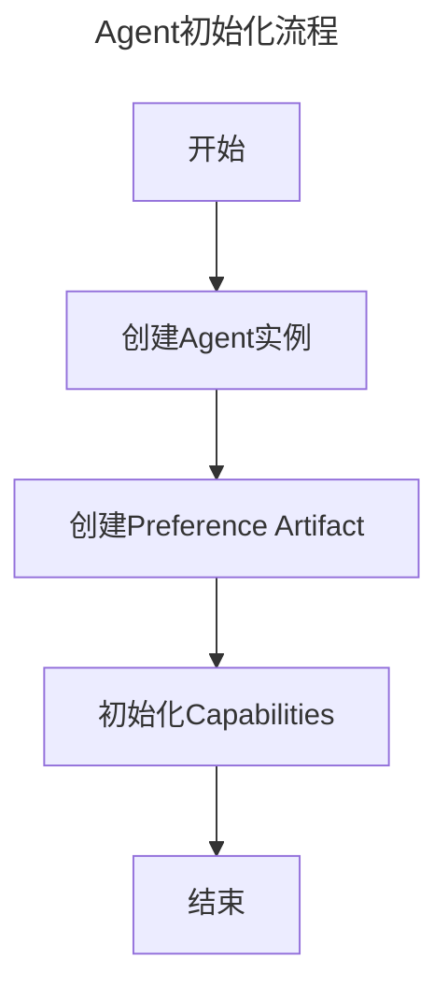
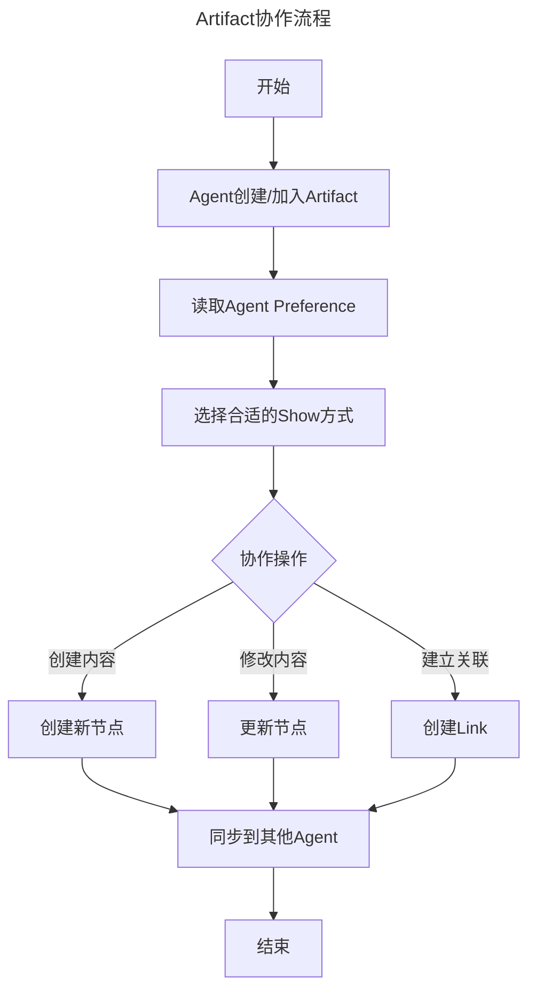

# Agentour项目设计

## 1. 项目设计
项目是一个Agent协作平台，主要功能是提供一个平台，供Agent进行协作。产品形态是一个协作编辑软件，人类与AI相当于在同一个编辑器里协作编辑的作者。包括以下两个核心概念：

- Agent：协作的参与者，包括以下三种类型：
  - HumanAgent：人类用户
  - MachineAgent：AI代理
  - CollectiveAgent：人类和AI的集合体，通过组合多个Agent形成新的能力
- Artifact：协作的对象，是一个图结构，其中的节点可以是代码、文件、会话等任何可协作的内容。节点之间通过Link建立关系，形成知识图谱。

### 1.1 统一数据结构定义

我们采用 GraphQL Schema 作为统一的数据定义方案，通过工具链自动生成各平台所需的代码。为了优化性能和简化实现，我们在具体实现时采用ID引用而不是完整对象嵌套。

#### GraphQL Schema 定义
```graphql
scalar JSON
scalar DateTime

"""
Agent 代表系统中的参与者，可以是人类用户、AI 或它们的组合
"""
type Agent {
  id: ID!
  type: AgentType!
  name: String!
  metadata: JSON!
  preferences: Artifact!     # 存储Agent偏好设置的Artifact
  capabilities: [Capability!]!
  createdAt: DateTime!
  updatedAt: DateTime!
  parentAgent: Agent        # 如果是CollectiveAgent，指向父Agent
  childAgents: [Agent!]     # 如果是CollectiveAgent，包含子Agent列表
}

"""
Agent 的类型枚举
"""
enum AgentType {
  HUMAN
  MACHINE
  COLLECTIVE
}

"""
Agent 具备的能力，可以通过插件系统扩展
"""
type Capability {
  name: String!
  description: String!
  parameters: JSON!
  active: Boolean!
  source: String!          # 能力来源，可以是内置或插件ID
}

"""
Artifact 是系统中的协作对象，可以是代码、文档、会话等
每个Artifact都是知识图谱中的一个节点
"""
type Artifact {
  id: ID!
  belong: Agent!
  content: Content!
  links: [Link!]!
  metadata: JSON!
  createdAt: DateTime!
  updatedAt: DateTime!
  version: Int!
  permissions: [Permission!]!
  type: String!           # Artifact类型，用于确定展示方式
  tags: [String!]!        # 用于分类和检索
}

"""
权限定义，支持继承和传播
"""
type Permission {
  agent: Agent!
  access: AccessLevel!
  grantedAt: DateTime!
  grantedBy: Agent!
  inherited: Boolean!     # 是否是继承的权限
  propagate: Boolean!    # 是否向下传播权限
}

enum AccessLevel {
  READ
  WRITE
  ADMIN
}

"""
Artifact 的具体内容
"""
type Content {
  rawContent: String!
  shows: [Show!]!
  version: Int!
  history: [ContentVersion!]!
}

"""
内容的历史版本
"""
type ContentVersion {
  version: Int!
  content: String!
  updatedAt: DateTime!
  updatedBy: Agent!
  comment: String        # 版本说明
}

"""
内容的展示方式，可以通过插件系统扩展
"""
type Show {
  type: String!          # 展示类型
  renderer: String!      # 渲染器，可以是内置或插件ID
  config: JSON!          # 渲染配置
  priority: Int!         # 优先级
  compatibility: [String!]! # 兼容的客户端类型
}

"""
Artifact 之间的关联，形成知识图谱
"""
type Link {
  id: ID!
  source: Artifact!
  target: Artifact!
  type: String!          # 关系类型
  metadata: JSON!        # 关系元数据
  createdAt: DateTime!
  createdBy: Agent!
  bidirectional: Boolean! # 是否是双向关系
}

# 查询接口
type Query {
  # Agent 相关查询
  agent(id: ID!): Agent
  agents(filter: AgentFilter): [Agent!]!
  myAgent: Agent!
  
  # Artifact 相关查询
  artifact(id: ID!): Artifact
  artifacts(filter: ArtifactFilter): [Artifact!]!
  searchArtifacts(query: String!, filter: ArtifactFilter): [Artifact!]!
  
  # 系统相关查询
  availableRenderers: [String!]!
  systemStatus: SystemStatus!
}

# 变更接口
type Mutation {
  # Agent 操作
  createAgent(input: CreateAgentInput!): Agent!
  updateAgent(id: ID!, input: UpdateAgentInput!): Agent!
  deleteAgent(id: ID!): Boolean!
  updateCapabilities(id: ID!, capabilities: [String!]!): Agent!
  
  # Artifact 操作
  createArtifact(input: CreateArtifactInput!): Artifact!
  updateArtifact(id: ID!, input: UpdateArtifactInput!): Artifact!
  deleteArtifact(id: ID!): Boolean!
  updatePermissions(id: ID!, permissions: [PermissionInput!]!): Artifact!
  
  # Link 操作
  createLink(input: CreateLinkInput!): Link!
  deleteLink(id: ID!): Boolean!
  
  # 内容操作
  updateContent(id: ID!, content: String!): Artifact!
  revertContent(id: ID!, version: Int!): Artifact!
}

# 订阅接口
type Subscription {
  artifactUpdated(id: ID!): ArtifactUpdateEvent!
  agentStatusChanged(id: ID!): AgentStatusEvent!
  systemAlert: SystemAlert!
}

# 事件和状态类型
type ArtifactUpdateEvent {
  artifact: Artifact!
  updateType: UpdateType!
  timestamp: DateTime!
  agent: Agent!
}

type AgentStatusEvent {
  agent: Agent!
  status: AgentStatus!
  timestamp: DateTime!
}

type SystemStatus {
  activeAgents: Int!
  totalArtifacts: Int!
  uptime: Int!
  version: String!
}

type SystemAlert {
  level: AlertLevel!
  message: String!
  timestamp: DateTime!
}

# 枚举类型
enum UpdateType {
  CREATED
  UPDATED
  DELETED
  PERMISSION_CHANGED
  LINKED
  UNLINKED
}

enum AgentStatus {
  ONLINE
  OFFLINE
  BUSY
  ERROR
}

enum AlertLevel {
  INFO
  WARNING
  ERROR
  CRITICAL
}

# 输入类型
input AgentFilter {
  types: [AgentType!]
  capabilities: [String!]
  status: AgentStatus
  createdAfter: DateTime
  updatedAfter: DateTime
}

input ArtifactFilter {
  belongTo: ID
  types: [String!]
  createdAfter: DateTime
  updatedAfter: DateTime
  hasPermission: AccessLevel
}

input CreateAgentInput {
  type: AgentType!
  name: String!
  metadata: JSON
  capabilities: [String!]
}

input UpdateAgentInput {
  name: String
  metadata: JSON
  capabilities: [String!]
}

input CreateArtifactInput {
  content: String!
  metadata: JSON
  shows: [ShowInput!]
}

input UpdateArtifactInput {
  content: String
  metadata: JSON
  shows: [ShowInput!]
}

input ShowInput {
  type: String!
  renderer: String!
  config: JSON!
  priority: Int!
}

input PermissionInput {
  agentId: ID!
  access: AccessLevel!
}

input CreateLinkInput {
  sourceId: ID!
  targetId: ID!
  type: String!
  metadata: JSON
}
```

### 1.2 Elixir数据结构

#### Agent数据结构
```elixir
defmodule Agent do
  @type t :: %Agent{
    id: String.t(),           # 全局唯一标识
    type: atom(),             # :human | :machine | :collective
    name: String.t(),         # 显示名称
    metadata: map(),          # 元数据
    preferences: String.t(),  # 对应的preference artifact的id
    capabilities: [Capability.t()], # agent具备的能力列表
    created_at: DateTime.t(), # 创建时间
    updated_at: DateTime.t(), # 更新时间
    parent_agent: String.t(), # 如果是CollectiveAgent，指向父Agent的id
    child_agents: [String.t()] # 如果是CollectiveAgent，包含子Agent的id列表
  }
end

defmodule Capability do
  @type t :: %Capability{
    name: String.t(),        # 能力名称
    description: String.t(), # 能力描述
    parameters: map(),       # 能力参数
    active: boolean(),       # 是否激活
    source: String.t()       # 能力来源，可以是内置或插件ID
  }
end
```

#### Artifact数据结构
```elixir
defmodule Artifact do
  @type t :: %Artifact{
    id: String.t(),          # 全局唯一标识
    belong: String.t(),      # 所属agent的id
    content: Content.t(),    # 内容
    links: [Link.t()],       # 与其他artifact的连接
    metadata: map(),         # 元数据
    created_at: DateTime.t(), # 创建时间
    updated_at: DateTime.t(), # 更新时间
    version: integer(),      # 版本号
    permissions: [Permission.t()], # 权限列表
    type: String.t(),        # Artifact类型，用于确定展示方式
    tags: [String.t()]       # 用于分类和检索
  }
end

defmodule Content do
  @type t :: %Content{
    raw_content: String.t(),    # 原始内容
    shows: [Show.t()],         # 可用的展示方式列表
    version: integer(),        # 版本号
    history: [ContentVersion.t()] # 历史版本
  }
end

defmodule ContentVersion do
  @type t :: %ContentVersion{
    version: integer(),       # 版本号
    content: String.t(),      # 内容
    updated_at: DateTime.t(), # 更新时间
    updated_by: String.t(),   # 更新者id
    comment: String.t()       # 版本说明
  }
end

defmodule Show do
  @type t :: %Show{
    type: String.t(),        # 展示类型
    renderer: String.t(),    # 渲染器，可以是内置或插件ID
    config: map(),           # 渲染配置
    priority: integer(),     # 优先级
    compatibility: [String.t()] # 兼容的客户端类型
  }
end

defmodule Link do
  @type t :: %Link{
    id: String.t(),          # 链接id
    source: String.t(),      # 源artifact的id
    target: String.t(),      # 目标artifact的id
    type: String.t(),        # 关系类型
    metadata: map(),         # 关系元数据
    created_at: DateTime.t(), # 创建时间
    created_by: String.t(),   # 创建者id
    bidirectional: boolean() # 是否是双向关系
  }
end

defmodule Permission do
  @type t :: %Permission{
    agent: String.t(),       # agent id
    access: atom(),          # :read | :write | :admin
    granted_at: DateTime.t(), # 授权时间
    granted_by: String.t(),   # 授权者id
    inherited: boolean(),    # 是否是继承的权限
    propagate: boolean()     # 是否向下传播权限
  }
end
```

### 1.2 工作流程

一个典型的使用流程包括两个主要环节：
1. Agent初始化流程
2. Artifact协作流程

#### Agent初始化流程：
当新的Agent（无论是人类还是AI）加入平台时，系统会：
1. 创建Agent实例
2. 创建该Agent的preference artifact，用于存储其偏好设置
3. 根据Agent类型初始化其capabilities



#### Artifact协作流程
Agent可以创建或加入已有的Artifact进行协作。系统会根据Agent的preference来决定如何展示Artifact。



## 2. 项目选型
项目的主体框架是Elixir Phoenix，前端默认使用Liveview和TailwindCSS。后端的Agent可根据需要，调用Python生态中的计算。项目几个主要组件的选型如下：

- 后端：
  - Elixir：负责大规模agent的组织
  - Phoenix：负责平台后端服务
  - Python：负责具体计算，特别是AI相关
    - 使用Pyrlang：https://github.com/Pyrlang/Pyrlang 与Elixir进行交互
  - IPFS：负责数据去中心化与持久化，并为Local-First应用提供社区协作所需要的网络能力
- 前端：
  - Liveview：负责前端页面渲染
  - salad_ui： https://github.com/bluzky/salad_ui 类似shadcn，负责前端组件库
- 数据库：
  - PostgreSQL：负责数据存储
  - ElextricSQL：https://electric-sql.com/docs/api/clients/elixir 负责Elixir与PostgreSQL的交互

### 未来扩展需要
- 前端未来可能引入react组件
- 后端数据在未来会进行去中心化改造（使用IPFS），因此需要考虑数据迁移问题
- 产品会推出插件市场，允许用户自定义并共享插件，插件包括以下几种：
  - 定义Agent功能，或将多种Agent/人类组织为新的Agent
  - 定义Artifact展示方式
  - 支持Agentour与其它平台对接，例如iOS、Android、微信小程序等

## 3. 项目结构

### 3.1 基础目录结构
```plaintext
agentour/
├── .formatter.exs
├── .gitignore
├── README.md
├── mix.exs                                     # 项目依赖配置
├── config/                                     # 配置文件目录
│   ├── config.exs                           # 基础配置
│   ├── dev.exs                               # 开发环境配置
│   ├── prod.exs                             # 生产环境配置
│   └── test.exs                              # 测试环境配置
├── plugins/               # 插件系统根目录
│   ├── manifest.json     # 插件系统配置清单
│   │
│   ├── core/            # 核心插件定义
│   │   ├── behaviours/  # 插件行为定义
│   │   │   ├── agent_plugin.ex      # Agent 插件行为
│   │   │   ├── artifact_plugin.ex   # Artifact 插件行为
│   │   │   └── view_plugin.ex       # 视图插件行为
│   │   │
│   │   ├── registry.ex  # 插件注册中心
│   │   └── loader.ex    # 插件加载器
│   │
│   ├── official/        # 官方插件
│   │   ├── code_agent/  # 示例：代码生成 Agent
│   │   │   ├── manifest.json   # 插件配置
│   │   │   ├── mix.exs        # 插件依赖
│   │   │   ├── lib/          # Elixir 代码
│   │   │   │   └── code_agent.ex
│   │   │   ├── python/       # Python 代码
│   │   │   │   └── code_generator.py
│   │   │   └── assets/       # 前端资源
│   │   │       ├── components/
│   │   │       └── styles/
│   │   │
│   │   └── markdown_artifact/  # 示例：Markdown 编辑器
│   │       ├── manifest.json
│   │       ├── mix.exs
│   │       ├── lib/
│   │       └── assets/
│   │
│   └── community/      # 社区插件目录
│       └── example_plugins/
├── lib/                                         # 主要源代码目录
│   ├── agentour/                         # 业务逻辑目录
│   │   ├── agents/                      # Agent 相关上下文
│   │   │   ├── agent.ex               # Agent 基础模型，统一人类、AI和集体的定义
│   │   │   ├── capabilities.ex        # Agent 能力定义
│   │   │   ├── preferences.ex         # Agent 偏好设置
│   │   │   └── registry.ex            # Agent 注册表
│   │   │
│   │   ├── artifacts/      # Artifact 相关上下文
│   │   │   ├── artifact.ex # Artifact 基础模型
│   │   │   ├── content.ex  # 内容管理
│   │   │   ├── version.ex  # 版本控制
│   │   │   ├── link.ex     # 关系管理
│   │   │   ├── show.ex     # 展示方式
│   │   │   └── permission.ex # 权限管理
│   │   │
│   │   ├── auth/           # 认证相关上下文
│   │   │   ├── guardian.ex # Guardian 配置
│   │   │   └── token.ex    # Token 管理
│   │   │
│   │   └── plugins/        # 插件系统
│   │       ├── plugin.ex   # 插件基础模型
│   │       └── registry.ex # 插件注册表
│   │   │
│   │   ├── python/           # Python 相关的 Elixir 接口
│   │   │   ├── client.ex     # Python 进程管理和通信客户端
│   │   │   ├── supervisor.ex # Python 进程监督者
│   │   │   └── api/         # Python API 封装
│   │   │       ├── llm.ex    # LLM 相关 API
│   │   │       ├── ml.ex     # 机器学习相关 API
│   │   │       └── utils.ex  # 通用工具 API
│   │
│   ├── agentour_web/       # Web 相关目录
│   │   ├── router.ex       # 路由配置
│   │   ├── endpoint.ex     # 端点配置
│   │   │
│   │   ├── controllers/    # 控制器目录
│   │   ├── live/          # LiveView 组件目录
│   │   │   ├── artifact_live/    # Artifact 相关组件
│   │   │   └── agent_live/       # Agent 相关组件
│   │   │
│   │   ├── components/    # 可重用组件
│   │   └── templates/     # 模板文件
│   │
│   └── agentour.ex        # 应用入口
│
├── priv/                   # 私有资源目录
│   ├── repo/              # 数据库迁移文件
│   │   └── migrations/
│   └── static/            # 静态文件
│   ├── python/              # Python 代码目录
│   │   ├── requirements.txt # Python 依赖
│   │   ├── main.py         # Python 服务入口
│   │   ├── provider/            # 外部提供商相关实现
│   │   │   ├── __init__.py
│   │   │   ├── openai.py
│   │   │   └── anthropic.py
│   │   │
│   │   ├── ml/             # 机器学习相关实现
│   │   │   ├── __init__.py
│   │   │   └── models.py
│   │   │
│   │   └── utils/          # 工具函数
│   │       ├── __init__.py
│   │       └── helpers.py
│
├── assets/                # 前端资源
│   ├── css/              # CSS 文件
│   │   └── app.css       # 主样式文件（包含 Tailwind）
│   ├── js/               # JavaScript 文件
│   └── tailwind.config.js # Tailwind 配置
│
├── test/                  # 测试目录
│    ├── agentour/         # 业务逻辑测试
│    ├── agentour_web/     # Web 测试
│    └── support/          # 测试支持文件
│
├── docs/                           # 文档根目录
│   ├── elixir/                    # Elixir 文档 (ExDoc)
│   │   ├── config/               
│   │   │   └── config.exs        # ExDoc 配置
│   │   ├── guides/               # 指南文档
│   │   │   ├── introduction.md
│   │   │   ├── installation.md
│   │   │   └── architecture.md
│   │   └── api/                  # API 文档（自动生成）
│   │
│   ├── python/                    # Python 文档 (Sphinx)
│   │   ├── source/              
│   │   │   ├── conf.py          # Sphinx 配置
│   │   │   ├── index.md        # 文档入口
│   │   │   ├── api/            # API 文档
│   │   │   │   ├── llm.md
│   │   │   │   └── ml.md
│   │   │   └── _static/        # 静态资源
│   │   ├── Makefile
│   │   └── requirements.txt     # Sphinx 依赖
│   │
│   ├── assets/                   # 共享资源
│   │   ├── images/
│   │   ├── css/
│   │   └── js/
│   │
│   └── index.html               # 统一文档入口
```

### 3.2 架构说明

1. **上下文划分**：
   - `agents`: 统一管理所有参与者（人类、AI、集体）
   - `artifacts`: 统一管理所有协作对象（文档、会话、代码等）
   - `auth`: 处理认证和授权
   - `plugins`: 处理插件系统
2. **LiveView 结构**：
   - 所有实时交互功能都放在 `live/` 目录下
   - 按功能模块分类组织组件
3. **Python 集成**：
   - Elixir 端提供 Python 调用接口
   - Python 代码放在 `priv/python` 目录
   - 支持 LLM 和机器学习功能
4. **可扩展性考虑**：
   - `plugins` 目录预留用于未来的插件系统
   - 文档版本控制支持为未来的 IPFS 集成做准备
5. **前端资源**：
   - 使用 Tailwind CSS 进行样式管理
   - 预留了未来集成 React 组件的空间
6. **测试结构**：
   - 测试目录结构与源码目录结构保持一致
   - 包含单元测试和集成测试支持

## 4.Python 集成示例

```elixir
# lib/agentour/python/api/llm.ex
defmodule Agentour.Python.API.LLM do
  alias Agentour.Python.Client

  def generate_text(prompt, opts \\ []) do
    Client.call_python(:llm, :generate_text, [prompt, opts])
  end
end
```

```python
# priv/python/llm/openai.py
from openai import OpenAI

class OpenAIClient:
    def __init__(self):
        self.client = OpenAI()

    def generate_text(self, prompt, **kwargs):
        response = self.client.chat.completions.create(
            model="gpt-4",
            messages=[{"role": "user", "content": prompt}],
            **kwargs
        )
        return response.choices[0].message.content
```

## 使用案例
### AI安全评测应用
- 用户创建一个安全评测Session，邀请或创建待安全评测/安全审计的Agent参与
- 用户在Session中首先创建一个Artifact，例如一个文本文件，作为评测流程的一个模板，例如一个Table，第一栏侧是评测问题，第二栏是被安全评测的Agent的输出结果，第三栏是评测Agent的评价结果
- 评测Agent会在第一栏评测问题中填入需要审计的安全问题，并提醒待评测Agent填写
- 待评测Agent填写完毕后，评测Agent会根据第三栏的评测结果，给出评价
- 评测结果完成后，评测Agent会提醒创建的人类用户给出反馈，并更新Artifact
- 评测Agent会根据反馈更新评测结果，并提醒待评测Agent进行调整
- 重复上述流程，直到评测Agent完成对所有待评测Agent的评测为止

### 电子名片与虚拟人社区
- 用户创建一个虚拟人社区Session
- 用户为自己创建一个名片Agent，作为自己在该Session中的代理
- 用户与名片Agent协作，编辑名片信息
- 用户还可以创建附属Agent的名片Agent，包括：
  - 宠物
  - 人格，可以代表自己某项爱好或专业技能
- 名片Agent可以代表用户，在Session中与其它名片Agent协作，以共同编辑Artifacts的形式共同完成某项任务
- Session中的其他用户可以查看开放的Artifacts，其所属的名片Agent会将其以适合用户的格式展示

### 代码生成与协作
- 用户创建一个代码生成Session
- 用户创建一个Artifact，并设置好设计文档、项目架构、代码风格、代码规范等内容，作为代码生成的模板
- 用户创建或邀请一批代码生成Agent参与Artifacts的协作编辑
- 代码生成Agent将根据设计文档、项目架构、代码风格、代码规范等内容，生成代码
- 用户可以在Artifact的聊天流中，输入代码生成需求，Agent将根据需求生成代码，并更新Artifact
- 用户还可以在Artifact中，以带可拖拽节点的Canvas形式，调整代码结构，并以全局视角查看所有参与编辑的Agent的修改

每个场景都充分利用了系统的图结构特性，通过Artifact之间的关联构建知识网络，并通过多个Agent的协作来完成任务。
