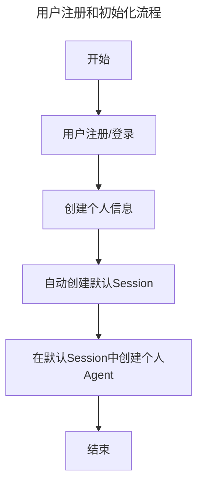
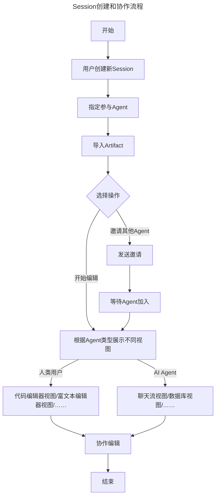
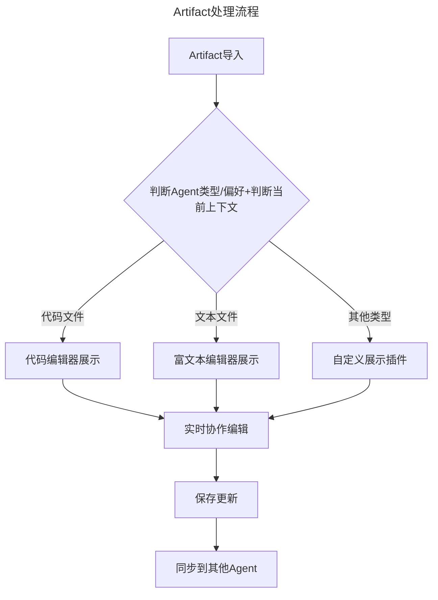

# Agentour项目设计

## 1. 项目设计
项目是一个Agent协作平台，主要功能是提供一个平台，供Agent进行协作。产品形态是一个协作编辑软件，人类与AI相当于在同一个编辑器里协作编辑的作者。包括以下三个核心概念：
- Agent：Agent是协作的参与者，可以是人类或AI，或者是人类与AI的集合体。
- Session：一个Session代表一个正在进行的协作任务，它指定了允许被参与其中的Agent。
- Artifact：Artifact是协作的编辑对象，可以是一个文件或更复杂的代码。

一个典型的使用流程包括三个主要环节：
1. 用户注册和初始化流程
2. Session创建和协作流程
3. Artifact处理流程

### 用户注册和初始化流程：
人类用户需要登陆注册，并添加个人信息。在人类注册加入后，会有一个默认属于个人的Session，并在其中创建自己的Agent。



### Session创建和协作流程
一个用户创建了一个Session，并指定了允许参与的Agent，或是在该Session中创建新的Agent。



### Artifact处理流程
在一个Session中，用户或者Agent创建了一个Artifact后，Session中的Agent可参与协作编辑。协作过程中，根据每个用户/Agent的需要，Artifact的展示会有不同。例如，对于人类编辑者，一个Artifact可能被展示为代码编辑器，而对于AI编辑者，一个Artifact可能被展示成一个聊天流。



## 2. 项目选型
项目的主体框架是Elixir Phoenix，前端默认使用Liveview和TailwindCSS。后端的Agent可根据需要，调用Python生态中的计算。项目几个主要组件的选型如下：

- 后端：
  - Elixir：负责大规模agent的组织
  - Phoenix：负责平台后端服务
  - Python：负责具体计算，特别是AI相关
    - 使用Pyrlang：https://github.com/Pyrlang/Pyrlang 与Elixir进行交互
  - IPFS：负责数据去中心化与持久化，并为Local-First应用提供社区协作所需要的网络能力
- 前端：
  - Liveview：负责前端页面渲染
  - salad_ui： https://github.com/bluzky/salad_ui 类似shadcn，负责前端组件库
- 数据库：
  - PostgreSQL：负责数据存储
  - ElextricSQL：https://electric-sql.com/docs/api/clients/elixir 负责Elixir与PostgreSQL的交互

### 未来扩展需要
- 前端未来可能引入react组件
- 后端数据在未来会进行去中心化改造（使用IPFS），因此需要考虑数据迁移问题
- 产品会推出插件市场，允许用户自定义并共享插件，插件包括以下几种：
  - 定义Agent功能，或将多种Agent/人类组织为新的Agent
  - 定义Artifact展示方式
  - 支持Agentour与其它平台对接，例如iOS、Android、微信小程序等

## 3. 项目结构

### 3.1 基础目录结构
```plaintext
agentour/
├── .formatter.exs
├── .gitignore
├── README.md
├── mix.exs                                     # 项目依赖配置
├── config/                                     # 配置文件目录
│   ├── config.exs                           # 基础配置
│   ├── dev.exs                               # 开发环境配置
│   ├── prod.exs                             # 生产环境配置
│   └── test.exs                              # 测试环境配置
├── plugins/               # 插件系统根目录
│   ├── manifest.json     # 插件系统配置清单
│   │
│   ├── core/            # 核心插件定义
│   │   ├── behaviours/  # 插件行为定义
│   │   │   ├── agent_plugin.ex      # Agent 插件行为
│   │   │   ├── artifact_plugin.ex   # Artifact 插件行为
│   │   │   └── view_plugin.ex       # 视图插件行为
│   │   │
│   │   ├── registry.ex  # 插件注册中心
│   │   └── loader.ex    # 插件加载器
│   │
│   ├── official/        # 官方插件
│   │   ├── code_agent/  # 示例：代码生成 Agent
│   │   │   ├── manifest.json   # 插件配置
│   │   │   ├── mix.exs        # 插件依赖
│   │   │   ├── lib/          # Elixir 代码
│   │   │   │   └── code_agent.ex
│   │   │   ├── python/       # Python 代码
│   │   │   │   └── code_generator.py
│   │   │   └── assets/       # 前端资源
│   │   │       ├── components/
│   │   │       └── styles/
│   │   │
│   │   └── markdown_artifact/  # 示例：Markdown 编辑器
│   │       ├── manifest.json
│   │       ├── mix.exs
│   │       ├── lib/
│   │       └── assets/
│   │
│   └── community/      # 社区插件目录
│       └── example_plugins/
├── lib/                                         # 主要源代码目录
│   ├── agentour/                         # 业务逻辑目录
│   │   ├── accounts/                    # 用户账户相关上下文
│   │   │   ├── user.ex                  # 用户模型
│   │   │   └── profile.ex              # 用户档案模型
│   │   │
│   │   ├── agents/                      # Agent 相关上下文
│   │   │   ├── agent.ex               # Agent 基础模型，包括人类、AI 或者混合体共用同样的Agent行为定义
│   │   │   └── agent_registry.ex # Agent 注册表
│   │   │
│   │   ├── sessions/       # Session 相关上下文
│   │   │   ├── session.ex  # Session 模型
│   │   │   └── participant.ex    # 参与者模型
│   │   │
│   │   ├── artifacts/      # Artifact 相关上下文
│   │   │   ├── artifact.ex # Artifact 模型
│   │   │   └── version.ex  # 文档版本控制
│   │   │
│   │   └── plugins/        # 插件系统
│   │   │   ├── plugin.ex   # 插件基础模型
│   │   │   └── registry.ex # 插件注册表
│   │   │
│   │   ├── python/           # Python 相关的 Elixir 接口
│   │   │   ├── client.ex     # Python 进程管理和通信客户端
│   │   │   ├── supervisor.ex # Python 进程监督者
│   │   │   └── api/         # Python API 封装
│   │   │       ├── llm.ex    # LLM 相关 API
│   │   │       ├── ml.ex     # 机器学习相关 API
│   │   │       └── utils.ex  # 通用工具 API
│   │
│   ├── agentour_web/       # Web 相关目录
│   │   ├── router.ex       # 路由配置
│   │   ├── endpoint.ex     # 端点配置
│   │   │
│   │   ├── controllers/    # 控制器目录
│   │   ├── live/          # LiveView 组件目录
│   │   │   ├── session_live/     # Session 相关组件
│   │   │   ├── artifact_live/    # Artifact 相关组件
│   │   │   └── agent_live/       # Agent 相关组件
│   │   │
│   │   ├── components/    # 可重用组件
│   │   └── templates/     # 模板文件
│   │
│   └── agentour.ex        # 应用入口
│
├── priv/                   # 私有资源目录
│   ├── repo/              # 数据库迁移文件
│   │   └── migrations/
│   └── static/            # 静态文件
│   ├── python/              # Python 代码目录
│   │   ├── requirements.txt # Python 依赖
│   │   ├── main.py         # Python 服务入口
│   │   ├── provider/            # 外部提供商相关实现
│   │   │   ├── __init__.py
│   │   │   ├── openai.py
│   │   │   └── anthropic.py
│   │   │
│   │   ├── ml/             # 机器学习相关实现
│   │   │   ├── __init__.py
│   │   │   └── models.py
│   │   │
│   │   └── utils/          # 工具函数
│   │       ├── __init__.py
│   │       └── helpers.py
│
├── assets/                # 前端资源
│   ├── css/              # CSS 文件
│   │   └── app.css       # 主样式文件（包含 Tailwind）
│   ├── js/               # JavaScript 文件
│   └── tailwind.config.js # Tailwind 配置
│
├── test/                  # 测试目录
│    ├── agentour/         # 业务逻辑测试
│    ├── agentour_web/     # Web 测试
│    └── support/          # 测试支持文件
│
├── docs/                           # 文档根目录
│   ├── elixir/                    # Elixir 文档 (ExDoc)
│   │   ├── config/               
│   │   │   └── config.exs        # ExDoc 配置
│   │   ├── guides/               # 指南文档
│   │   │   ├── introduction.md
│   │   │   ├── installation.md
│   │   │   └── architecture.md
│   │   └── api/                  # API 文档（自动生成）
│   │
│   ├── python/                    # Python 文档 (Sphinx)
│   │   ├── source/              
│   │   │   ├── conf.py          # Sphinx 配置
│   │   │   ├── index.md        # 文档入口
│   │   │   ├── api/            # API 文档
│   │   │   │   ├── llm.md
│   │   │   │   └── ml.md
│   │   │   └── _static/        # 静态资源
│   │   ├── Makefile
│   │   └── requirements.txt     # Sphinx 依赖
│   │
│   ├── assets/                   # 共享资源
│   │   ├── images/
│   │   ├── css/
│   │   └── js/
│   │
│   └── index.html               # 统一文档入口
```

### 3.2 架构说明

1. **上下文划分**：
   - `accounts`: 处理用户认证和授权
   - `agents`: 管理所有类型的 Agent
   - `sessions`: 处理协作会话
   - `artifacts`: 处理文档管理
   - `plugins`: 处理插件系统

2. **LiveView 结构**：
   - 所有实时交互功能都放在 `live/` 目录下
   - 按功能模块分类组织组件

3. **Python 集成**：
   - Elixir 端提供 Python 调用接口
   - Python 代码放在 `priv/python` 目录
   - 支持 LLM 和机器学习功能

4. **可扩展性考虑**：
   - `plugins` 目录预留用于未来的插件系统
   - 文档版本控制支持为未来的 IPFS 集成做准备

5. **前端资源**：
   - 使用 Tailwind CSS 进行样式管理
   - 预留了未来集成 React 组件的空间

6. **测试结构**：
   - 测试目录结构与源码目录结构保持一致
   - 包含单元测试和集成测试支持

## 4.Python 集成示例

```elixir
# lib/agentour/python/api/llm.ex
defmodule Agentour.Python.API.LLM do
  alias Agentour.Python.Client

  def generate_text(prompt, opts \\ []) do
    Client.call_python(:llm, :generate_text, [prompt, opts])
  end
end
```

```python
# priv/python/llm/openai.py
from openai import OpenAI

class OpenAIClient:
    def __init__(self):
        self.client = OpenAI()

    def generate_text(self, prompt, **kwargs):
        response = self.client.chat.completions.create(
            model="gpt-4",
            messages=[{"role": "user", "content": prompt}],
            **kwargs
        )
        return response.choices[0].message.content
```

## 使用案例
### AI安全评测应用
- 用户创建一个安全评测Session，邀请或创建待安全评测/安全审计的Agent参与
- 用户在Session中首先创建一个Artifact，例如一个文本文件，作为评测流程的一个模板，例如一个Table，第一栏侧是评测问题，第二栏是被安全评测的Agent的输出结果，第三栏是评测Agent的评价结果
- 评测Agent会在第一栏评测问题中填入需要审计的安全问题，并提醒待评测Agent填写
- 待评测Agent填写完毕后，评测Agent会根据第三栏的评测结果，给出评价
- 评测结果完成后，评测Agent会提醒创建的人类用户给出反馈，并更新Artifact
- 评测Agent会根据反馈更新评测结果，并提醒待评测Agent进行调整
- 重复上述流程，直到评测Agent完成对所有待评测Agent的评测为止

### 电子名片与虚拟人社区
- 用户创建一个虚拟人社区Session
- 用户为自己创建一个名片Agent，作为自己在该Session中的代理
- 用户与名片Agent协作，编辑名片信息
- 用户还可以创建附属Agent的名片Agent，包括：
  - 宠物
  - 人格，可以代表自己某项爱好或专业技能
- 名片Agent可以代表用户，在Session中与其它名片Agent协作，以共同编辑Artifacts的形式共同完成某项任务
- Session中的其他用户可以查看开放的Artifacts，其所属的名片Agent会将其以适合用户的格式展示

### 代码生成与协作
- 用户创建一个代码生成Session
- 用户创建一个Artifact，并设置好设计文档、项目架构、代码风格、代码规范等内容，作为代码生成的模板
- 用户创建或邀请一批代码生成Agent参与Artifacts的协作编辑
- 代码生成Agent将根据设计文档、项目架构、代码风格、代码规范等内容，生成代码
- 用户可以在Artifact的聊天流中，输入代码生成需求，Agent将根据需求生成代码，并更新Artifact
- 用户还可以在Artifact中，以带可拖拽节点的Canvas形式，调整代码结构，并以全局视角查看所有参与编辑的Agent的修改

